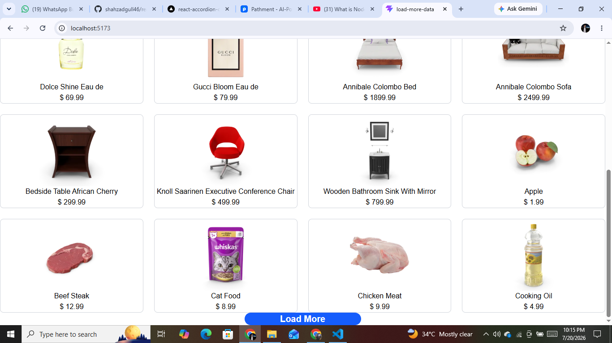
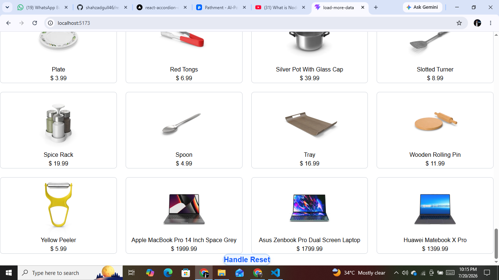

# React Load More Data

A modern React application that demonstrates the **Load More** functionality by fetching products from the DummyJSON API. Products are loaded in batches, providing a better user experience and improved performance compared to rendering a large dataset all at once.

## 🚀 Live Demo

🔗 https://react-accordion-component-v4yo.vercel.app
---

## 📸 Screenshots

### Load More Button



### Reset Button



---

## ✨ Features

- Fetches product data from the DummyJSON API
- Displays products in batches
- Load More functionality
- Reset functionality to reload products
- Responsive product grid
- Loading state while fetching data
- Error handling for failed API requests
- Clean and reusable React components
- Built using React Hooks (`useState` & `useEffect`)

---

## 🛠️ Tech Stack

- React
- JavaScript (ES6+)
- CSS / Tailwind CSS
- DummyJSON API

---

## 📂 Project Structure

```text
src/
│
├── assets/
│   ├── loadButton.png
│   └── resetButton.png
│
├── components/
│   ├── LoadMore.jsx
│   └── ProductCard.jsx
│
├── App.jsx
└── main.jsx
```

---

## ⚙️ Installation

Clone the repository

```bash
git clone https://github.com/shahzadgull46/<repository-name>.git
```

Navigate to the project

```bash
cd <repository-name>
```

Install dependencies

```bash
npm install
```

Start the development server

```bash
npm run dev
```

---

## 📚 What I Learned

- Working with REST APIs using `fetch()`
- Managing asynchronous data in React
- Using `useEffect` for data fetching
- Updating state with previous state values
- Conditional rendering
- Creating reusable React components
- Handling loading and error states
- Building responsive layouts

---

## 🌐 API Used

DummyJSON Products API

https://dummyjson.com/products

---

## 👨‍💻 Author

**Shahzad Ahmad Gull**

GitHub: https://github.com/shahzadgull46